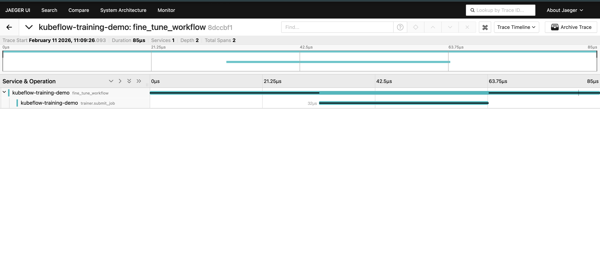

# Kubeflow OpenTelemetry PoC

A proof-of-concept demonstrating how [OpenTelemetry](https://opentelemetry.io/) can be integrated into the **Kubeflow Training SDK** to add observability across its client libraries. This PoC covers distributed tracing, W3C context propagation to Kubernetes pods, GenAI semantic conventions, configurable exporters, and the API-vs-SDK separation that keeps the library lightweight.

## Architecture

```
┌─────────────────────────────────────────────────────────────────┐
│                      User Application                          │
│  examples/train_job_demo.py                                    │
│  ┌────────────────────────────────────────────────────────────┐ │
│  │  • Configures TracerProvider (OpenTelemetry SDK)           │ │
│  │  • Calls MockTrainerClient.train()                        │ │
│  │  • Records GenAI token-usage attributes                   │ │
│  └────────────────────────────────────────────────────────────┘ │
│        │  uses                                                  │
│        ▼                                                        │
│  ┌────────────────────────────────────────────────────────────┐ │
│  │  sdk_mock/ — Kubeflow SDK (Library)                       │ │
│  │  Uses opentelemetry-api ONLY (no SDK)                     │ │
│  │                                                            │ │
│  │  trainer_client.py                                        │ │
│  │    └─ Creates span "trainer.submit_job"                   │ │
│  │    └─ Sets GenAI + Kubeflow attributes                    │ │
│  │                                                            │ │
│  │  propagator.py                                            │ │
│  │    └─ inject_context_to_env()                             │ │
│  │    └─ Serialises trace context → TRACEPARENT env var      │ │
│  └────────────────────────────────────────────────────────────┘ │
└────────────────────┬────────────────────────────────────────────┘
                     │ OTLP/gRPC (:4317)
                     ▼
          ┌──────────────────────┐
          │   OTel Collector     │
          │   (otel-config.yaml) │
          └──────────┬───────────┘
                     │ OTLP/gRPC
                     ▼
          ┌──────────────────────┐
          │   Jaeger             │
          │   UI → :16686        │
          └──────────────────────┘
```

### API vs SDK — Why It Matters

| Layer | Dependency | Rationale |
|-------|-----------|-----------|
| **Library** (`sdk_mock/`) | `opentelemetry-api` only | Keeps the Kubeflow SDK lightweight; users who don't enable tracing get a no-op tracer with zero overhead. |
| **Application** (`examples/`) | `opentelemetry-sdk` + exporter | The end-user opts in to observability by configuring a `TracerProvider` and exporter. |

## Repository Structure

```
kubeflow-otel-poc/
├── README.md                  # This file
├── docker-compose.yaml        # Launches Jaeger + OTel Collector
├── otel-config.yaml           # Collector configuration
├── requirements.txt           # Python dependencies
├── sdk_mock/                  # Mocked Kubeflow SDK components
│   ├── __init__.py
│   ├── trainer_client.py      # Instrumented MockTrainerClient
│   └── propagator.py          # W3C context injection logic
└── examples/
    └── train_job_demo.py      # End-user demo script
```

## Quick Start

### 1. Install Dependencies

```bash
pip install -r requirements.txt
```

### 2. Run the Demo (Console Output)

```bash
python examples/train_job_demo.py
```

You'll see the submitted job, injected `TRACEPARENT`, and spans printed to the console.

### 3. Run with Jaeger (Optional)

```bash
# Start the observability stack
docker compose up -d

# Run the demo (spans now go to Jaeger)
python examples/train_job_demo.py

# Open Jaeger UI
open http://localhost:16686
```

Search for service **`kubeflow-training-demo`** to see the trace with the `trainer.submit_job` span and all its attributes.

## Features Demonstrated in This PoC

The table below maps each expected feature to where it is showcased in the codebase:

| # | Expected Feature | Where It's Demonstrated |
|---|-----------------|------------------------|
| 1 | **Add OpenTelemetry instrumentation to key Kubeflow SDK components** | `sdk_mock/trainer_client.py` — The `MockTrainerClient` is instrumented using `opentelemetry-api`. A span `"trainer.submit_job"` is created on every `.train()` call with rich attributes (`gen_ai.request.model`, `kubeflow.job_type`, etc.). |
| 2 | **Enable distributed tracing for pipeline execution and SDK operations** | `sdk_mock/propagator.py` — `inject_context_to_env()` serializes the active trace context into a W3C `TRACEPARENT` env var. This is the mechanism that lets a remote Kubernetes Pod continue the same trace started by the SDK. |
| 3 | **Collect and export metrics related to AI/ML workloads** | `examples/train_job_demo.py` — GenAI semantic convention attributes are recorded on spans: `gen_ai.usage.input_tokens`, `gen_ai.usage.output_tokens`, and a `"Fine-tuning started"` event. These follow the [OTel GenAI conventions](https://opentelemetry.io/blog/2024/otel-generative-ai/). |
| 4 | **Provide configurable OTel exporters and sampling options** | `examples/train_job_demo.py` — The demo auto-detects the environment: it tries the **OTLP gRPC exporter** (→ Collector → Jaeger) and falls back to a **ConsoleSpanExporter** if the Collector is unreachable. The `TracerProvider` is configured app-side, not inside the library. |
| 5 | **Documentation and examples demonstrating observability setup and usage** | This `README.md` + `examples/train_job_demo.py` — Full quick-start guide, architecture diagram, and a runnable demo script. |

### How the API-vs-SDK Separation Works

The most important design principle: **library code uses only `opentelemetry-api`**, never `opentelemetry-sdk`.

- If a user **does not** configure a `TracerProvider`, all tracing calls inside the SDK become **no-ops** with zero performance overhead.
- If a user **does** configure a `TracerProvider` (as in `train_job_demo.py`), spans are automatically created and exported — no SDK code changes needed.

This is identical to how popular libraries like `requests`, `flask`, and `django` are instrumented in the OpenTelemetry ecosystem.

## SDK Clients Covered

This PoC mocks the **TrainerClient** (`MockTrainerClient`), but the same instrumentation pattern applies directly to all Kubeflow SDK clients:

| SDK Client | What Would Be Instrumented | Span / Attributes |
|------------|---------------------------|--------------------|
| **TrainerClient** *(demonstrated)* | `.train()` — job submission, model config | `trainer.submit_job`, `gen_ai.request.model`, `kubeflow.job_type` |
| **KubeflowClient** | `.create_run()`, `.get_run()` — pipeline operations | `pipeline.create_run`, `pipeline.run_id`, `pipeline.status` |
| **KFPClient** (Pipelines) | `.create_experiment()`, `.run_pipeline()` | `kfp.create_experiment`, `kfp.pipeline_name`, `kfp.experiment_id` |
| **KatibClient** | `.create_experiment()` — hyperparameter tuning | `katib.create_experiment`, `katib.objective`, `katib.algorithm` |
| **KFServingClient / InferenceClient** | `.create()`, `.predict()` — model serving | `inference.create_service`, `inference.predict`, `gen_ai.request.model` |

For each client, the pattern is the same:
1. Get a **tracer** via `trace.get_tracer("kubeflow-sdk")`
2. Wrap key methods with `tracer.start_as_current_span()`
3. Set semantic attributes on the span
4. Call `inject_context_to_env()` before creating K8s resources

## Cleanup

```bash
docker compose down
```

## Output Images:




Rest of the images are in the `public` folder.
