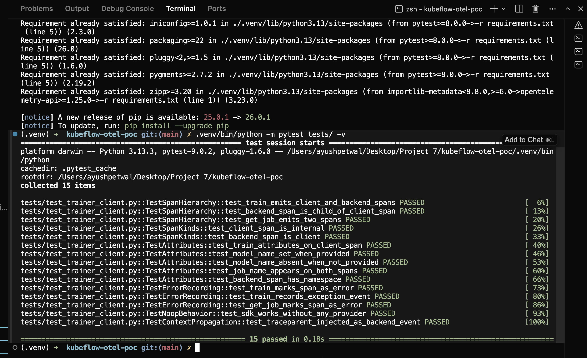
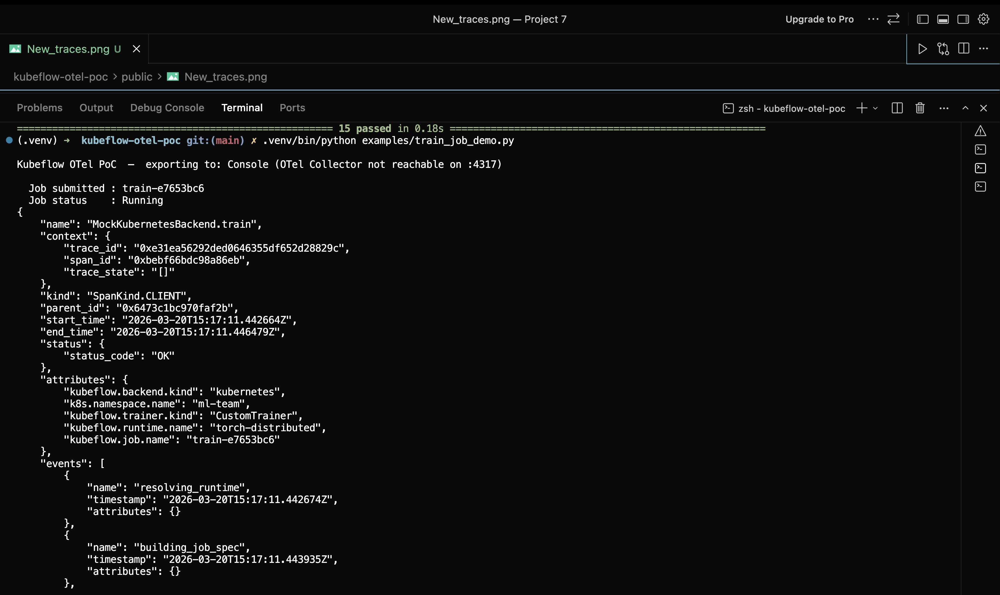
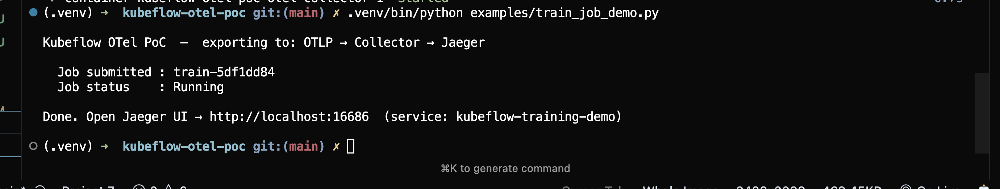
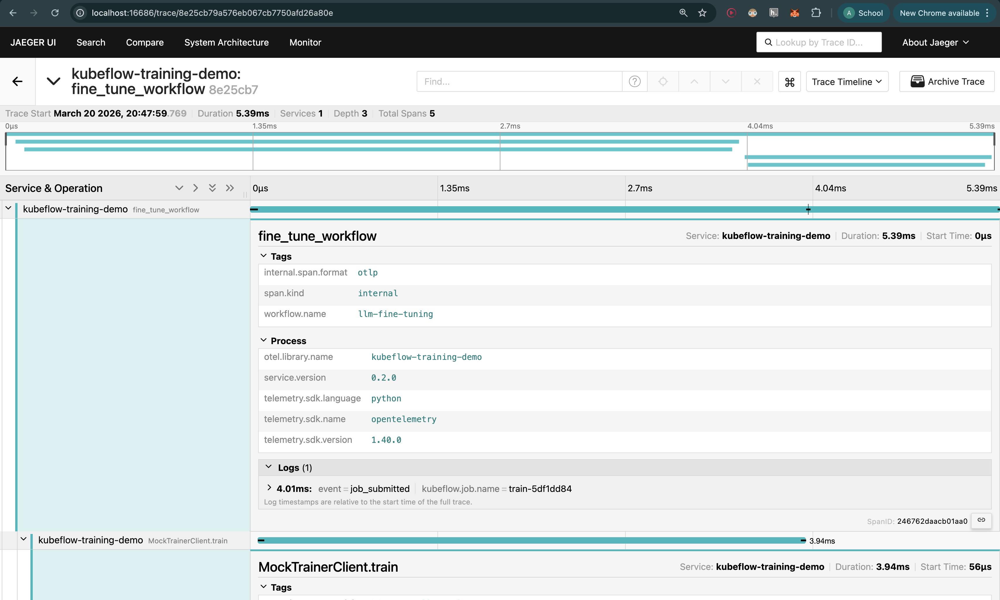
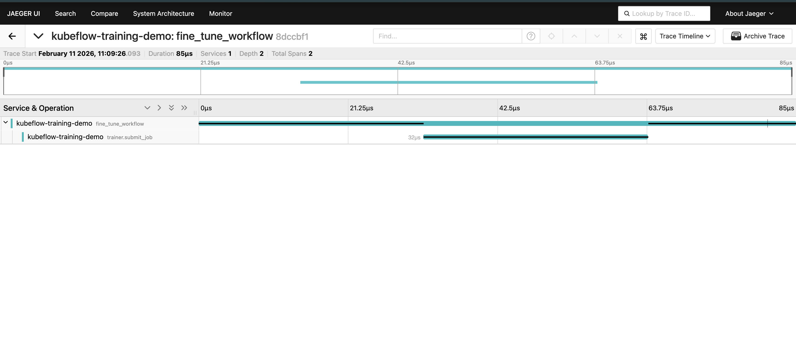
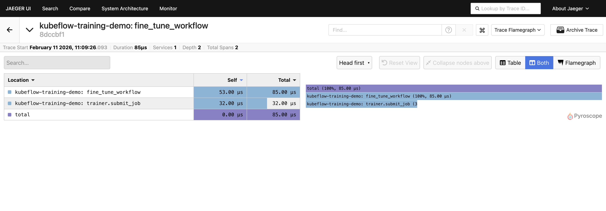
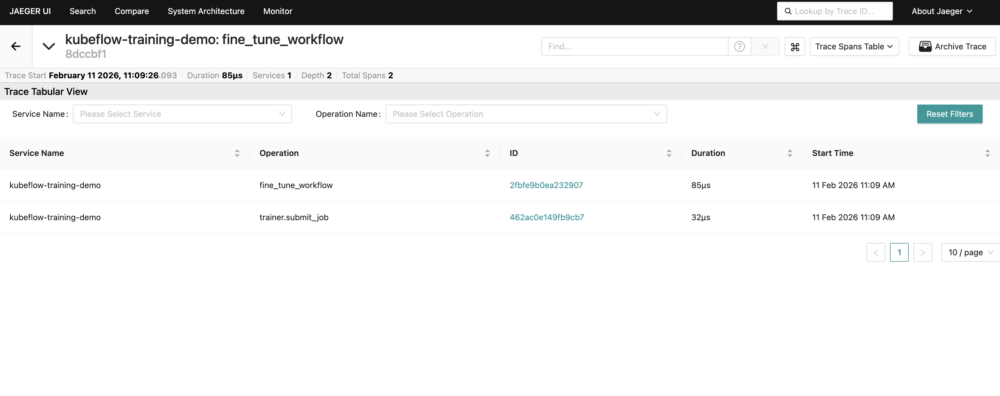
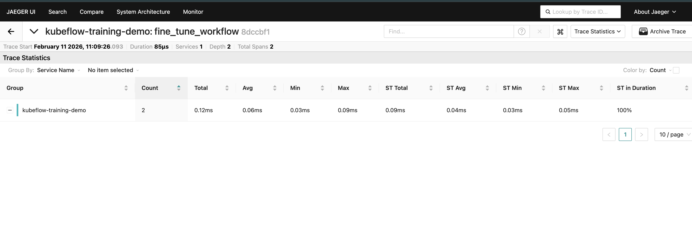

# Kubeflow OpenTelemetry PoC

Proof-of-concept for adding native OpenTelemetry observability to the **Kubeflow Training SDK** — distributed tracing, metrics, W3C context propagation, and zero overhead for non-OTel users.

---

## Problem

The Kubeflow Training SDK has no structured observability. Users cannot answer:
- Which Kubernetes API call was slow during job submission?
- Did the error happen in the SDK or the K8s API server?
- How many jobs are running, and what fraction fail?

---

## Solution

Instrument the SDK using `opentelemetry-api` only. Users who don't configure a provider get a **no-op tracer** — zero overhead. Users who do get full traces and metrics automatically.

---

## Architecture

```
User Application (examples/train_job_demo.py)
  └── configures TracerProvider + OTLP exporter
        │
        ▼
  MockTrainerClient          [INTERNAL span]   sdk_mock/trainer_client.py
  └── MockKubernetesBackend  [CLIENT span]     sdk_mock/backends/kubernetes_backend.py
        └── events: resolving_runtime, building_job_spec,
                    traceparent_injected, submitting_to_k8s_api
                    │
                    ▼ OTLP/gRPC (:4317)
             OTel Collector  →  Jaeger (:16686)
```

**Span depth is fixed at 2.** Sub-operations are span events, not child spans — traces stay readable.

---

## Key Features

### 1. API-only library instrumentation
`sdk_mock/` imports `opentelemetry-api` only — never `opentelemetry-sdk`. Non-OTel users bear zero cost (no threads, no memory, no network).

### 2. Two-level span hierarchy
| Span | Kind | Where |
|------|------|--------|
| `MockTrainerClient.train` | INTERNAL | User-facing contract: what was requested |
| `MockKubernetesBackend.train` | CLIENT | Execution: K8s API calls and timing |

### 3. W3C Trace Context propagation
`trace_env_vars()` serialises the active span context into `TRACEPARENT` / `TRACESTATE` env vars, injected into the pod spec before the K8s API call — so pod-side telemetry joins the same trace.

### 4. Four metrics instruments (low-cardinality only)
| Metric | Type | Dimensions |
|--------|------|-----------|
| `kf.training.jobs.submitted` | Counter | `backend.kind`, `trainer.kind` |
| `kf.training.operation.latency` | Histogram (s) | `operation`, `backend.kind` |
| `kf.training.jobs.running` | UpDownCounter | `backend.kind` |
| `kf.training.failures` | Counter | `operation`, `error.type`, `backend.kind` |

High-cardinality values (job names, runtime names) go on **spans only** — never metric dimensions.

### 5. Typed attribute constants (`observability/attributes.py`)
Domain-grouped constants (`JOB_NAME`, `TRAINER_KIND`, `BACKEND_KIND`, …) prevent silent typos and enable IDE autocomplete. `gen_ai.request.model` is set only when a model URI is explicitly present.

### 6. Configurable exporter with console fallback
Demo auto-detects environment: OTLP → Collector → Jaeger when the stack is up; falls back to `ConsoleSpanExporter` when it's not.

### 7. Full test suite — 15/15 passing
`capture_spans()` patches module-level `_tracer` references via `unittest.mock.patch` — avoids the one-shot `set_tracer_provider()` restriction and works across all 15 tests independently.

---

## Quick Start

```bash
# 1. Install
pip install -r requirements.txt

# 2. Run tests
.venv/bin/python -m pytest tests/ -v

# 3. Demo — console only (no Docker needed)
.venv/bin/python examples/train_job_demo.py

# 4. Demo — full stack (traces visible in Jaeger)
docker compose up -d
.venv/bin/python examples/train_job_demo.py
open http://localhost:16686   # service: kubeflow-training-demo
```

---

## Output

### Tests — 15/15 passing


### Console fallback (no collector)
Span JSON printed to terminal — no stack required.



### With collector → Jaeger


### Trace in Jaeger — 3-level hierarchy
`fine_tune_workflow` → `MockTrainerClient.train` → `MockKubernetesBackend.train`



### Trace timeline


### Flamegraph view


### Spans table


### Trace statistics


---

## Repo Structure

```
kubeflow-otel-poc/
├── sdk_mock/
│   ├── observability/
│   │   ├── __init__.py          # make_tracer() / make_meter() factories
│   │   ├── attributes.py        # typed attribute-key constants
│   │   └── propagation.py       # trace_env_vars() — W3C context injection
│   ├── backends/
│   │   ├── kubernetes_backend.py  # CLIENT span, span events
│   │   └── local_backend.py       # INTERNAL span (local subprocess)
│   └── trainer_client.py          # INTERNAL span + 4 metrics instruments
├── tests/
│   ├── helpers.py               # capture_spans() via mock.patch
│   └── test_trainer_client.py   # 15 tests across 5 classes
├── examples/
│   └── train_job_demo.py        # 3-level trace demo, OTLP + console fallback
├── docker-compose.yaml          # Jaeger + OTel Collector
└── otel-config.yaml             # Collector pipeline config
```

---

## Cleanup

```bash
docker compose down
```
